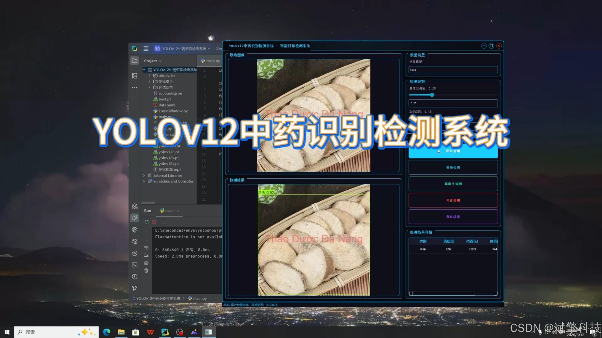
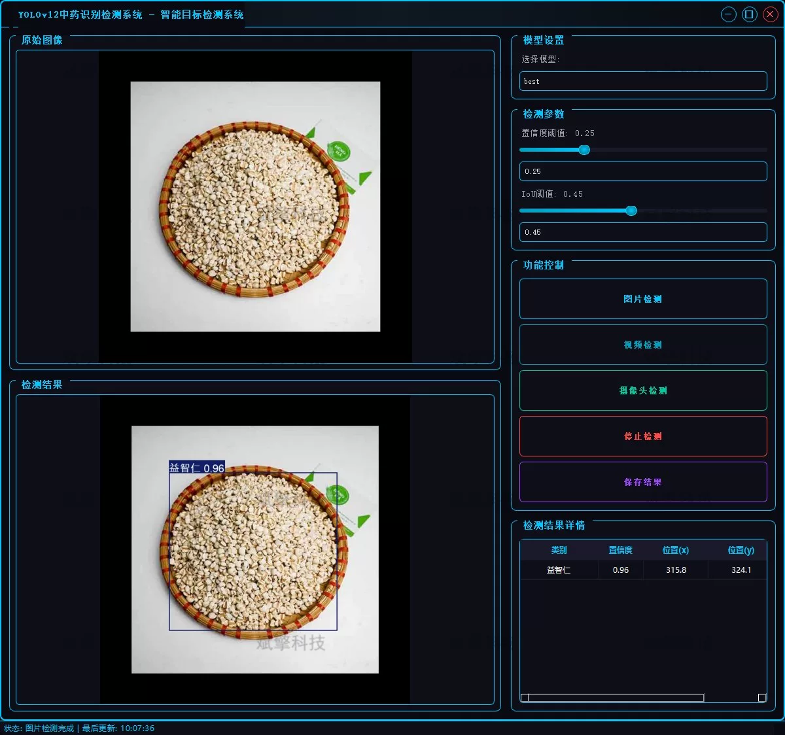
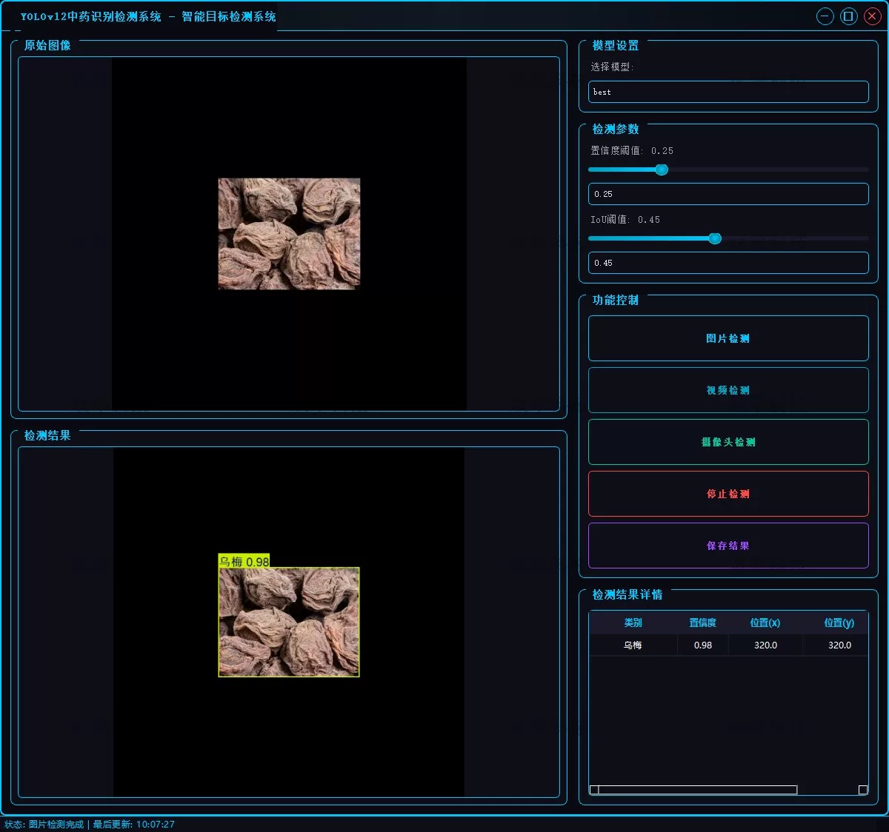
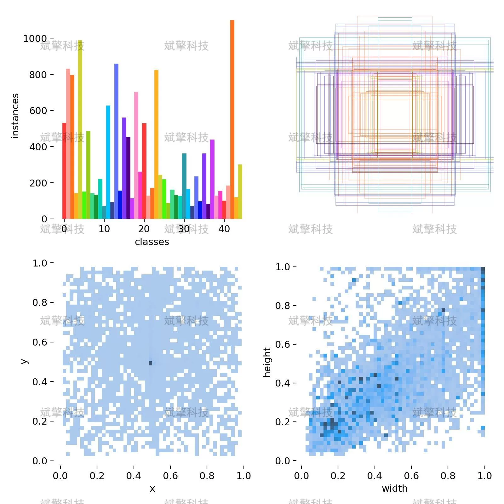
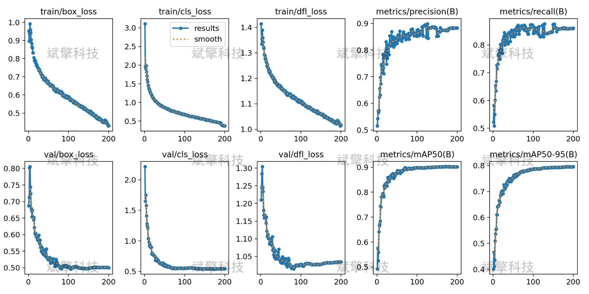
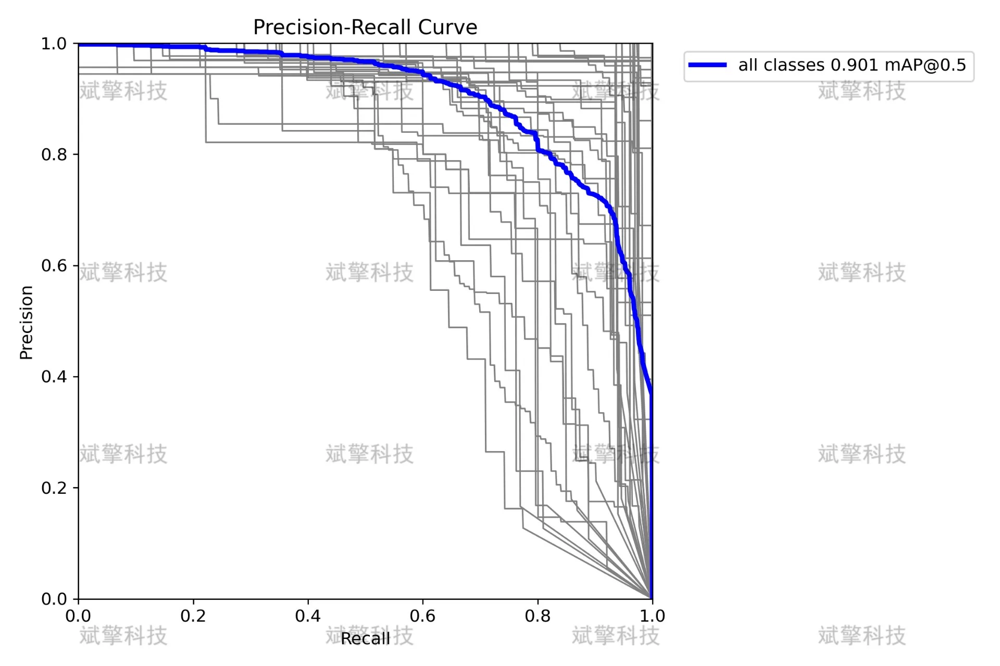

# Based on deep learning YOLOv12 Chinese medicinal material identification detection system (YOLOv1)

## Body

Based on the cutting-edge YOLOv12 object detection algorithm, a highly efficient and precise intelligent detection system for traditional Chinese medicine (TCM) medicinal slices has been developed.
This system is designed to train models for 45 commonly used TCM ingredients (including roots, stems, fruits, leaves, and processed products), utilizing a large-scale TCM dataset of 10,000 labeled images. By leveraging the outstanding feature extraction capabilities and detection speed of YOLOv12, it achieves high-precision localization and classification of TCM slices in complex backgrounds. The system not only supports recognition of static images but also expands real-time video stream detection and dynamic camera capture functions, meeting various application scenarios such as automated verification in pharmacies, inventory counting of medicinal materials, online teaching demonstrations, and mobile device assistance in identification. Experimental results show that this system maintains real-time performance while achieving high recognition accuracy, providing an effective technical solution for the intelligent identification of TCM.

System Function Overview
✅ User Login and Registration: Supports password verification and security validation.
✅ Three Detection Modes: Based on the YOLOv12 model, supports image, video, and real-time camera detection, accurately identifying targets.
✅ Dual-Screen Comparison: Displays original images and detection results simultaneously on the screen.
✅ Data Visualization: Real-time table displaying the category, confidence, and coordinates of detected targets.
✅ Intelligent Parameter Tuning: Offers a confidence slide bar for dynamic optimization of detection accuracy, adapting to different scene requirements.
✅ Sci-Fi Style Interactive Interface: Dark theme paired with dynamic light effects, reducing visual fatigue and enhancing operational experience.
✅ Multi-Thread High-Performance Architecture: Independent detection threads ensure smooth operation, real-time status prompts, and rapid response without lag.
Dataset Introduction
Training set: 8500 images
Validation set: 1500 images

## Images

## Payment

Here is a pay link on Stripe ( https://buy.stripe.com/3cs8yP7sY87d0vu9AB ). Please contact me lonlonago@foxmail.com after funding $89, and I will send you a complete data files , thank you!

